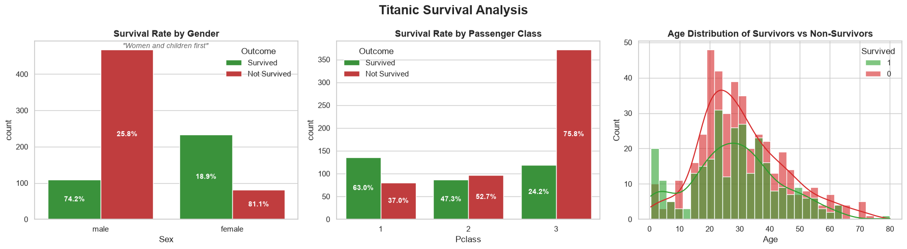

# Titanic Survival Prediction Model

Titanic Survival Prediction using Advanced Feature Engineering

## Overview
This project predicts passenger survival on the Titanic using machine learning and advanced feature engineering techniques. The objective was not only to build an accurate classifier but also to understand the factors that influenced survival and demonstrate an end-to-end data science workflow.

Built with AI-assisted development (Gemini) as part of an active learning process in applied machine learning.

## Project Highlights
- **84.3% mean Cross-Validation accuracy** (5-fold Stratified CV on training data)
- **77.9% on the actual Kaggle test leaderboard** — included alongside the CV score deliberately, since CV accuracy is measured on data the model has seen variations of during training, while the leaderboard score reflects performance on truly unseen data. Reporting the gap rather than only the higher number is the more honest signal of real-world generalization.
- Advanced Feature Engineering
- Multiple Model Comparison via Ensemble Learning
- Explainable Insights through EDA

## Exploratory Data Analysis



A few patterns that shaped the feature engineering: survival rate was 74.2% for women vs. 18.9% for men, and 63.0% for 1st class vs. 24.2% for 3rd class — reflecting the "women and children first" evacuation protocol and the resource access advantage of higher fare classes.

## Step by Step Approach

1. Studied raw data: number of rows/columns, range of variables, missing values
2. Data cleansing
3. EDA: explored multiple graphs to understand connections between variables
4. Feature Engineering: Title extraction & grouping, Deck from Cabin, FamilySize, IsAlone, FarePerPerson, LogFare, AgeBin — applied consistently across train and test to avoid data leakage
5. Models Evaluated (5-fold Stratified CV): Random Forest, LightGBM, XGBoost, Logistic Regression
6. Final Model: Soft-voting ensemble of all four models, weighted toward the tree-based learners
7. Predictions generated and submitted to the [Kaggle Titanic competition](https://www.kaggle.com/competitions/titanic)

## Key Skills Demonstrated
- Data Cleaning
- Exploratory Data Analysis
- Feature Engineering (leakage-aware, train/test consistent)
- Ensemble Learning (soft-voting classifier)
- Stratified Cross-Validation
- Model Evaluation
- Python, Scikit-Learn, LightGBM, XGBoost
- AI-Assisted Development / Prompt Engineering

## Setup
```bash
pip install -r requirements.txt
```
Data files (`train.csv`, `test.csv`) are sourced from the [Kaggle Titanic competition](https://www.kaggle.com/competitions/titanic/data).

## License
This project is licensed under the MIT License — see [LICENSE](LICENSE) for details.
